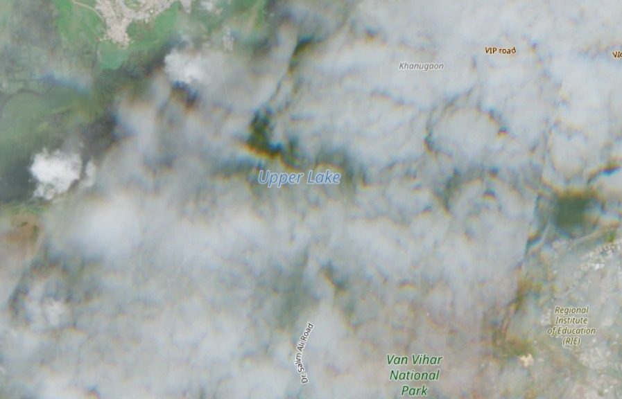
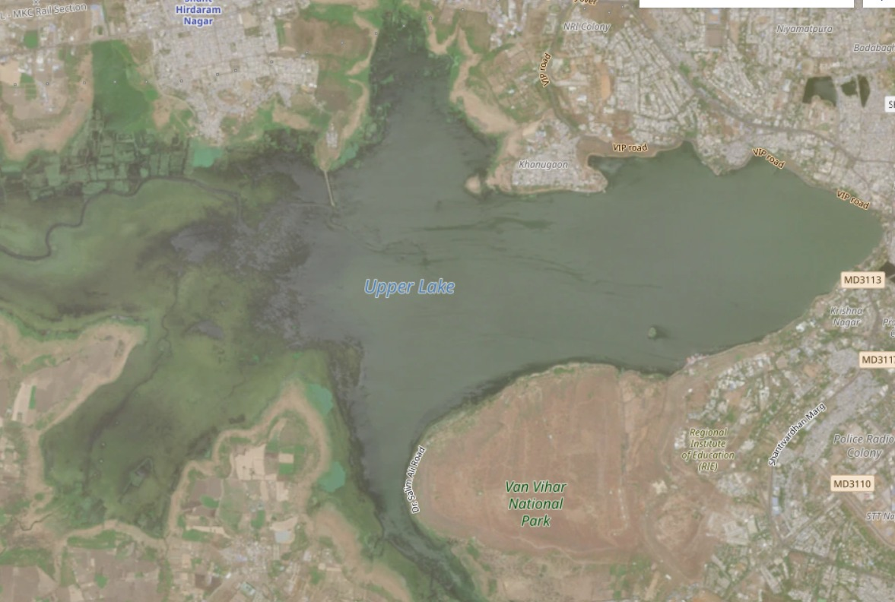
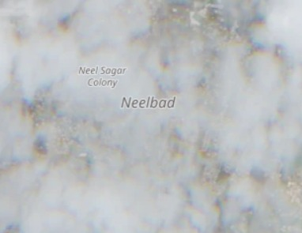
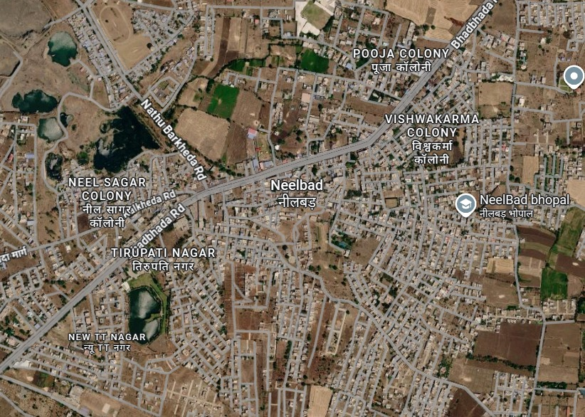
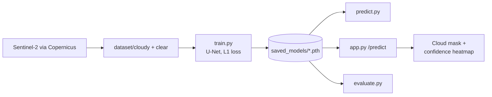

<div align="center">

# AkashaLens

**Cloud removal for satellite imagery: a U-Net that reconstructs what the clouds hide.**

Sentinel-2 ingestion · cloud mask and confidence heatmap · Flask demo · built for ISRO Hackathon 2026

<br />

<table>
  <tr>
    <td align="center"><br /><sub>Cloudy sample (<code>dataset/cloudy</code>)</sub></td>
    <td align="center"><br /><sub>Clear sample (<code>dataset/clear</code>)</sub></td>
  </tr>
</table>
<sub>Dataset samples, not model output. No trained weights ship with the repo, so there are no reconstruction results to show.</sub>

<br />
<br />

   

<br />

**[Run it](#run-it)** &nbsp;·&nbsp; **[Features](#features)** &nbsp;·&nbsp; **[Architecture](#architecture)** &nbsp;·&nbsp; **[Installation](#installation)** &nbsp;·&nbsp; **[Limitations](#limitations)**

</div>

---

Cloud cover blocks optical satellite imagery exactly when the ground matters most. AkashaLens treats cloud removal as an image-to-image reconstruction problem: given a cloudy scene, predict the clear scene underneath. The repository holds the whole prototype pipeline: a Copernicus download script for Sentinel-2 data, a PyTorch U-Net, training and evaluation scripts, and a Flask demo that shows a cloud mask and a confidence heatmap next to each reconstruction.

It is a prototype. The bundled dataset is three cloudy and clear pairs, and no trained weights or benchmark numbers are included.

## Run it

```bash
git clone https://github.com/Samudra-GITHub/AkashaLens.git
cd AkashaLens && python -m venv .venv && .venv\Scripts\activate && pip install -r requirements.txt
python train.py                 # trains on dataset/ and writes saved_models/akashalens_model.pth
python app.py                   # http://127.0.0.1:5000
```

Run every command from the repository root. Training on the three sample pairs is only enough to check that the pipeline works.

## Features

<table>
  <tr>
    <td width="50%" valign="top">
      <h3>A U-Net reconstruction model</h3>
      <p>Three downsampling stages, trained with L1 loss and the Adam optimiser on 256×256 RGB image pairs. With fewer than 10 pairs it trains on everything ("prototype mode"); with 10 or more it uses an 80/20 split and keeps the best validation checkpoint.</p>
    </td>
    <td width="50%" valign="top">
      <h3>Cloud mask and confidence</h3>
      <p>A rule-based detector (luminance and colour saturation thresholds) produces a mask and a cloud-cover percentage. A confidence heatmap derived from the mask shows which regions of a reconstruction to trust least.</p>
    </td>
  </tr>
  <tr>
    <td width="50%" valign="top">
      <h3>Ground-truth evaluation</h3>
      <p>MAE, PSNR and SSIM, either in the web app (optional ground-truth upload) or across the dataset with <code>evaluate.py</code>, which also saves side-by-side comparison figures.</p>
    </td>
    <td width="50%" valign="top">
      <h3>Data ingestion</h3>
      <p><code>scripts/get_copernicus.py</code> downloads Sentinel-2 L1C products over a fixed bounding box, sorted by cloud cover. Credentials come from environment variables.</p>
    </td>
  </tr>
</table>

**Also:** command-line inference with `predict.py`; smoke scripts in `tests/` for image loading, model shapes and dataset pairing; a Vercel configuration for the Flask app.

## Dataset

Training data are paired images in `dataset/cloudy/` and `dataset/clear/`, sorted by name and paired by position, resized to 256×256 at load time.

<table>
  <tr>
    <td align="center"><br /><sub>cloudy2</sub></td>
    <td align="center"><br /><sub>clear2</sub></td>
    <td align="center"><br /><sub>cloudy3</sub></td>
    <td align="center"><br /><sub>clear3</sub></td>
  </tr>
</table>

To fetch more Sentinel-2 data:

```bash
python scripts/get_copernicus.py
```

The script downloads the five clearest and five cloudiest products into `dataset/clear/` and `dataset/cloudy/` as `.zip` archives. The training code reads ordinary image files, so the archives must be converted to RGB images first, which this repository does not do. The script also pairs scenes by cloud-cover rank, not by location and date, so review the pairs before training. `python -m tests.test_dataset` checks that the two folders line up.

## Tech stack

| Layer | Technology |
| :-- | :-- |
| Model | PyTorch, torchvision |
| Image processing and metrics | Pillow, NumPy, SciPy, scikit-image, Matplotlib |
| Web app | Flask, Werkzeug, vanilla JavaScript and CSS |
| Data source | Copernicus Data Space (Sentinel-2) |
| Deployment config | Vercel (`vercel.json`) |

## Architecture



At inference, `app.py` runs two things on the uploaded image: the rule-based cloud detector in `utils.py` (mask, cloud-cover percentage, confidence map) and the U-Net reconstruction. The `/predict` endpoint returns the reconstruction, mask and heatmap URLs, the percentages, and MAE, PSNR and SSIM when a ground truth is supplied.

```text
AkashaLens/
├── app.py            Flask app (also the Vercel entry point)
├── config.py         Paths, image size, batch size, epochs, learning rate, device
├── dataset.py        SatelliteDataset: pairs cloudy/ and clear/ images
├── train.py          Training loop
├── evaluate.py       MAE / PSNR / SSIM over the dataset, plus comparison figures
├── predict.py        Reconstruct one image from the command line
├── utils.py          Image loading, cloud detection, confidence map, metrics
├── models/unet.py    U-Net architecture
├── scripts/          get_copernicus.py
├── dataset/          cloudy/ and clear/
├── tests/            Smoke scripts: image loading, model shapes, dataset pairing
├── static/  templates/   Web app front end
└── vercel.json  requirements.txt  .env.example
```

The core modules stay at the repository root on purpose: they import each other as flat modules, `config.py` paths are relative to the root, and `app.py` must be at the root as the Vercel entry point.

## Installation

Requires Python 3 (PyTorch needs a supported version).

```bash
python -m venv .venv
.venv\Scripts\activate          # macOS/Linux: source .venv/bin/activate
pip install -r requirements.txt
```

| Command | What it does |
| :-- | :-- |
| `python train.py` | Train and save `saved_models/akashalens_model.pth` (git-ignored) |
| `python evaluate.py` | Metrics over the dataset; figures go to `output/eval/` |
| `python predict.py path/to/cloudy.jpg` | Write `output/reconstructed_<name>` |
| `python app.py` | Run the web demo on port 5000 |

Evaluation, prediction and the web demo need trained weights. Without them the app starts with a warning and predictions are not meaningful.

### Environment

Only the Copernicus download script needs credentials. Register for free at [dataspace.copernicus.eu](https://dataspace.copernicus.eu).

| Variable | Purpose |
| :-- | :-- |
| `COPERNICUS_USERNAME` | Copernicus Data Space account email |
| `COPERNICUS_PASSWORD` | Copernicus Data Space password |

`.env.example` is a template and `.env` is git-ignored. The scripts do not load `.env` themselves, so export the variables in your shell:

```bash
export COPERNICUS_USERNAME=your_email        # PowerShell: $env:COPERNICUS_USERNAME="your_email"
export COPERNICUS_PASSWORD=your_password
```

Never commit credentials.

### Deploy

`vercel.json` configures a `@vercel/python` build of `app.py`, serves `/static/*` directly and routes everything else to the app. Weights are not committed, and the repository does not document how PyTorch and the weights are packaged for Vercel, so treat deployment as unverified.

## Limitations

- Tiny dataset, no trained weights and no reported metrics.
- No script yet to convert Copernicus archives into aligned image pairs.
- The web demo was not captured for this README, so there are no screenshots of it.

## License

[MIT](LICENSE).
