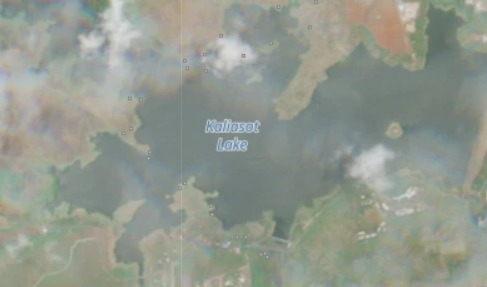
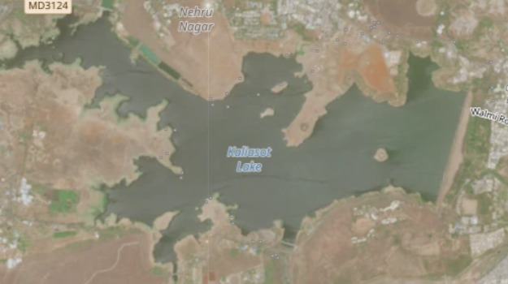
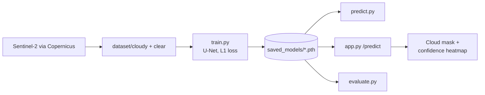

<div align="center">

# AkashaLens

**Cloud removal for satellite imagery: a U-Net that reconstructs what the clouds hide.**

Sentinel-2 ingestion · cloud mask and confidence heatmap · Flask demo · built for ISRO Hackathon 2026

<br />

<table>
  <tr>
    <td align="center"><br /><sub>Cloudy sample (<code>dataset/cloudy</code>)</sub></td>
    <td align="center"><br /><sub>Clear sample (<code>dataset/clear</code>)</sub></td>
  </tr>
</table>
<sub>Dataset samples, not model output. No trained weights ship with the repo.</sub>

<br />
<br />

**[Overview](#overview)** &nbsp;·&nbsp; **[Features](#features)** &nbsp;·&nbsp; **[Getting started](#getting-started)** &nbsp;·&nbsp; **[Architecture](#architecture)** &nbsp;·&nbsp; **[Structure](#project-structure)**

<br />

   

</div>

---

## Overview

Cloud cover blocks optical satellite imagery exactly when the ground matters most. AkashaLens treats cloud removal as an image-to-image reconstruction problem: given a cloudy scene, predict the clear scene underneath. It includes tooling to download Sentinel-2 products from Copernicus, a PyTorch U-Net, training and evaluation scripts, and a web demo that also shows a cloud mask and a confidence heatmap for each prediction.

This is a prototype. The bundled dataset is tiny (three cloudy/clear pairs), and no trained weights or benchmark results are included in the repository.

## Features

- **U-Net reconstruction model** (three downsampling stages) trained with L1 loss and the Adam optimiser on 256×256 RGB image pairs
- **Cloud detection and masking**: a heuristic based on luminance and colour saturation, which reports a cloud-cover percentage
- **Confidence heatmap** derived from the cloud mask, so low-confidence regions of a reconstruction are visible
- **Ground-truth evaluation** of MAE, PSNR and SSIM, either in the web app (optional upload) or across the dataset with `evaluate.py`
- **Command-line inference** with `predict.py`
- **Copernicus ingestion script** that downloads Sentinel-2 L1C products over a fixed area
- **Flask web demo** with an upload form and result views

## Tech Stack

| Area | Technology |
| --- | --- |
| Model | PyTorch, torchvision |
| Image processing and metrics | Pillow, NumPy, SciPy, scikit-image, Matplotlib |
| Web app | Flask, Werkzeug, vanilla JavaScript and CSS |
| Data source | Copernicus Data Space (Sentinel-2) |
| Deployment config | Vercel (`vercel.json`) |

## Project Structure

```
AkashaLens/
├── app.py               # Flask app (also the Vercel entry point)
├── config.py            # Paths, image size, batch size, epochs, learning rate, device
├── dataset.py           # SatelliteDataset: pairs cloudy/ and clear/ images
├── train.py             # Training loop
├── evaluate.py          # MAE / PSNR / SSIM over the dataset, plus comparison figures
├── predict.py           # Reconstruct a single image from the command line
├── utils.py             # Image loading, cloud detection, confidence map, metrics
├── models/
│   └── unet.py          # U-Net architecture
├── scripts/
│   └── get_copernicus.py  # Sentinel-2 download from Copernicus
├── dataset/
│   ├── cloudy/          # Cloud-occluded inputs
│   └── clear/           # Clear targets
├── tests/               # Smoke scripts: image loading, model shapes, dataset pairing
├── static/  templates/  # Web app front end
├── vercel.json  requirements.txt  .env.example
└── LICENSE  CHANGELOG.md  CONTRIBUTING.md
```

The core modules sit at the repository root on purpose: they import each other as flat modules, paths in `config.py` are relative to the repository root, and `app.py` must stay at the root as the Vercel entry point. Run every command below from the repository root.

## Getting Started

Requires Python 3 (PyTorch needs a supported version).

```bash
git clone https://github.com/Samudra-GITHub/AkashaLens.git
cd AkashaLens
python -m venv .venv
.venv\Scripts\activate          # macOS/Linux: source .venv/bin/activate
pip install -r requirements.txt
```

## Configuration

Only the Copernicus download script needs credentials. Create a free account at [dataspace.copernicus.eu](https://dataspace.copernicus.eu), then set:

| Variable | Purpose |
| --- | --- |
| `COPERNICUS_USERNAME` | Copernicus Data Space account email |
| `COPERNICUS_PASSWORD` | Copernicus Data Space password |

`.env.example` is a template and `.env` is git-ignored. The scripts do not load `.env` themselves, so export the variables in your shell:

```bash
export COPERNICUS_USERNAME=your_email        # PowerShell: $env:COPERNICUS_USERNAME="your_email"
export COPERNICUS_PASSWORD=your_password
```

Never commit credentials. The training, prediction and web app code needs no secrets.

## Data Preparation

Training data are paired images in `dataset/cloudy/` and `dataset/clear/`. Files are sorted by name and paired by position, so keep the two folders aligned. Images are resized to 256×256 at load time. The repository includes three sample pairs.

To fetch more Sentinel-2 data:

```bash
python scripts/get_copernicus.py
```

The script queries Sentinel-2 L1C products over a fixed bounding box, sorts them by cloud cover, and downloads the five clearest into `dataset/clear/` and the five cloudiest into `dataset/cloudy/`, as `.zip` product archives. The training code reads ordinary image files, so these archives must be converted to RGB images first, which this repository does not do for you. The script also pairs scenes by rank rather than by matching location and date, so review pairs before training on them.

Check that the folders line up:

```bash
python -m tests.test_dataset
```

## Training

```bash
python train.py
```

With fewer than 10 pairs it trains on everything without a validation split ("prototype mode"). With 10 or more it uses an 80/20 train/validation split and saves the best validation checkpoint. Weights are written to `saved_models/akashalens_model.pth`, which is git-ignored. Hyperparameters (batch size, epochs, learning rate) are in `config.py`.

## Evaluation and Inference

```bash
python evaluate.py                          # metrics over the dataset; figures saved to output/eval/
python predict.py path/to/cloudy_image.jpg  # writes output/reconstructed_<name>
```

Both need trained weights in `saved_models/`.

## Running the Web App

```bash
python app.py        # http://127.0.0.1:5000
```

Upload a cloudy image (optionally with a clear ground-truth image). The `/predict` endpoint returns the reconstruction, a cloud mask, a confidence heatmap, the cloud-cover and confidence percentages, and MAE / PSNR / SSIM when a ground truth is supplied. If no trained model is found, the app starts but logs a warning and prediction will not produce meaningful output. Uploads go to `uploads/` and results to `output/`, both git-ignored.

## Architecture



At inference, `app.py` runs two things on the uploaded image: the rule-based cloud detector in `utils.py` (mask, cloud-cover percentage, confidence map) and the U-Net reconstruction.

## Deployment

`vercel.json` configures a `@vercel/python` build of `app.py`, serves `/static/*` directly and routes everything else to the app. Weights are not committed, so a deployment needs a trained model made available to the app. The repository does not document how PyTorch and the weights are packaged for Vercel, so treat deployment as unverified.

## Future Improvements

- Expand the dataset well beyond the current sample pairs
- Add a script to convert Copernicus archives into aligned image pairs
- Compare attention-based U-Net variants against the baseline
- Batch inference for full scene tiles instead of fixed 256×256 resizes
- Report evaluation results once a model has been trained on a real dataset

## License

MIT, see [LICENSE](LICENSE).
